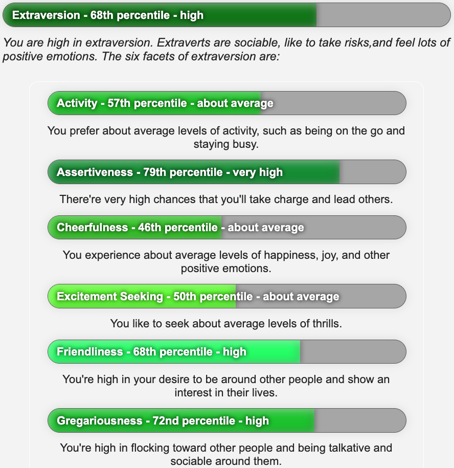
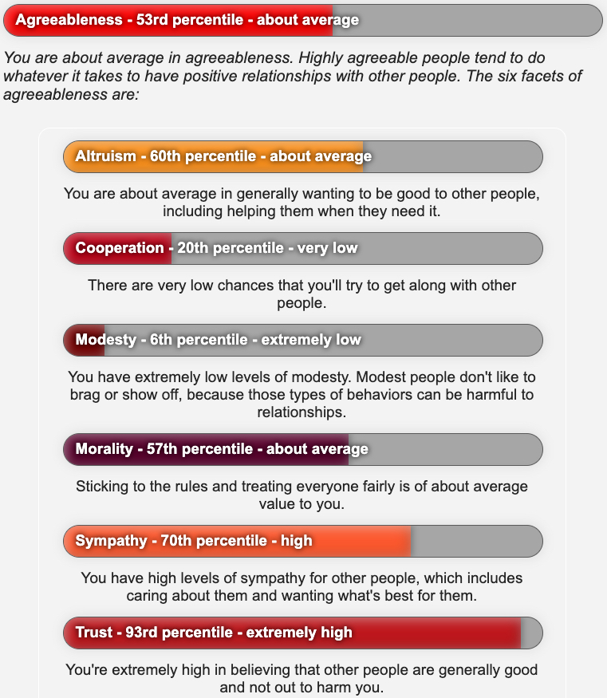
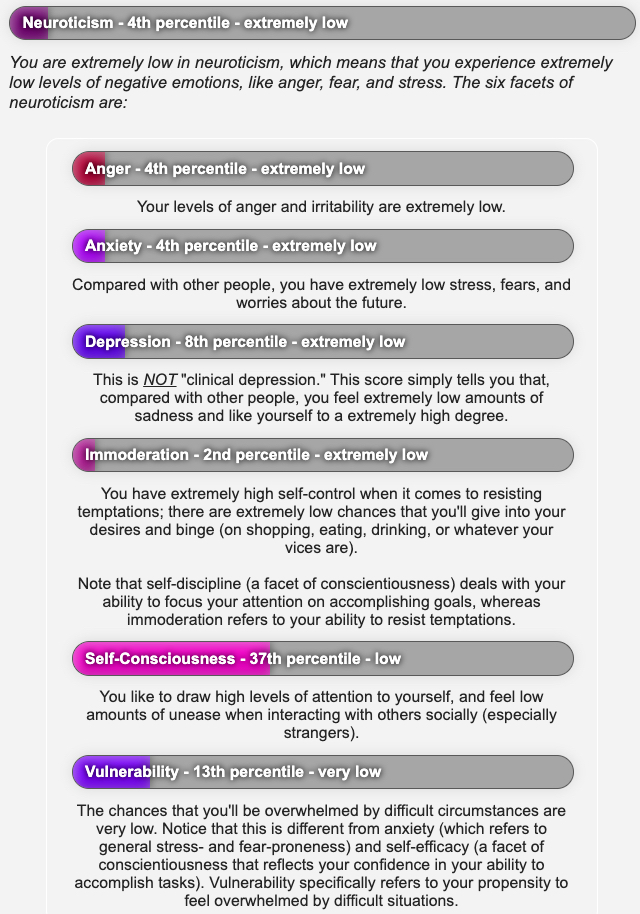

From the most comprehensive (free) Big Five test: [here](https://www.personalityassessor.com/ipip-300/). More explanation in the [wiki](https://en.wikipedia.org/wiki/Big_Five_personality_traits). Subtraits below.   

Aus dem umfassendsten (gratis) Test der Big Five: [hier](https://www.personalityassessor.com/ipip-300/). Weitergehende Erklärung im [Wiki](https://de.wikipedia.org/wiki/Big_Five_(Psychologie)). Untereigenschaften weiter unten.

Openness/Offenheit  

Conscientiousness/Gewissenhaftigkeit  

Extraversion  
  

Agreeableness/Verträglichkeit  

Neuroticism/Neurotizismus  

