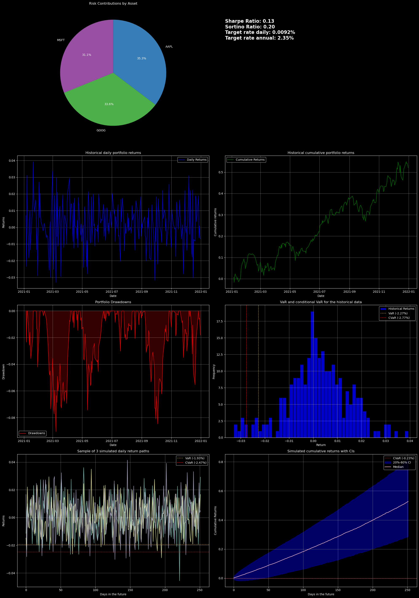

# Portfolio Risk and Return Analysis

This Python project performs an analysis of a portfolio of stocks by calculating returns and cumulative returns, calculating risk metrics, projecting future daily and cumulative returns, and plotting the results in a dashboard (an example is provided at the very bottom).  
The program accepts the start and end date for the historical portfolio data and the list of stock ticker symbols (like "AAPL" or "TSLA") via the command line, but they can also be provided after the program starts running (the user will be prompted if nothing was provided). Afterwards, the portfolio weights are queried from the user and a target rate for calculating the Sharpe and Sortino ratios. That could be a risk-free rate. Daily or annual rates are accepted.

The output dashboard is substantially prettier if it is rendered in a `.ipynb` due to its size. So in the not too distant future I'll provide a notebook containing equivalent code (module imports and command line arguments will work a little differently).

## The modules
#### `main.py`: Main entry point; orchestrates the entire workflow.  
The `main()` function generates all numbers by calling the relevant functions from their modules, by looking into the command line, or via helper functions in the `main` module itself; e.g., `get_dates()` or `get_weights()`. The heart is then `generate_dashboard()` which takes all of those and composes them into the output dashboard by calling the visualization functions.  
A design alternative I decided against for no particular reason is to also get the weights and (easier) the target interest rate from command line arguments. Another consideration was to have `get_tickers()` check the ticker symbols from the command line the way it checks the tickers input by the user if none were provided yet. Presumably, if someone inputs the ticker list via the terminal, they'd like to save some time. Given that `process_data()` immediately tries to query data for the tickers, any error would also immediately become obvious.

#### `datafetch.py`: Fetches and processes historical stock data.  
Contains helper functions to fetch stock data using `yfinance`, calculate daily returns from the stock prices for the individual stocks and daily and cumulative returns for the entire portfolio using provided weights; there is also a function to get the market capitalizations for the tickers and then calculate weights by those market capitalization. Another helper tries to fetch some data for a ticker to check whether it is a valid ticker at all.  

#### `future_simulation.py`: Simulates future returns and calculates their C/VaR.  
A relatively brief module that simulates future returns by drawing from a Normal with mean and SD of the provided historical returns. Another function then calculates the C/VaR for the daily and cumulative simulated returns.  
Currently, `monte_carlo_var()` calls the `simulate_future_returns()` function itself on provided returns. A design alternative would have been to feed simulated returns directly instead of calculating them within the function.

#### `risk_metrics.py`: Computes portfolio risk metrics like Sharpe ratio and VaR.  
Contains a handful of relatively brief helpers that calculate risk metrics for portfolio returns; only the `risk_contributions()` function needs the returns of the individual stocks rather than of the entire portfolio's returns since it needs to calculate the covariance matrix of the returns. The functions calculate various well established risk metrics whose formulas can be looked up online. The VaR calculation defaults to the historical method of simply looking at the bottom, e.g., 5% of returns instead of assuming normality, but that latter method is also available.

#### `visualization.py`: Generates plots.  
Various relatively simple functions to plot the calculations and data from above. The main difference between the functions is the labeling. One of the things that's not like the others is the plotting of simulated cumulative returns. That function plots the median cumulative returns and a custom CI around it.  
A design alternative would have been to feed the to be plotted values directly into the functions; currently they themselves usually call the functions that calculate the relevant data. E.g., `plot_cumulative_returns()` calls the `cumulative_returns()` function itself on the provided portfolio returns.

## Libraries Used

- `argparse` for command line arguments
- `datetime`for checking dates input by user
- `scipy.stats` for the Normal percentile function
- `numpy` and `pandas` for data manipulation
- `matplotlib` for visualizations
- `tkinter` for screen resolution adjustments
- `yfinance` for querying stock data
- Custom modules: `datafetch`, `future_simulation`, `risk_metrics`, `visualization`

## Usage
1. Run the program with:  
`python main.py --start YYYY-MM-DD --end YYYY-MM-DD TICKER1 TICKER2 ...`  
Example:  
`python main.py --start 2023-01-01 --end 2023-12-31 AAPL MSFT GOOG`

2. Follow on-screen prompts to:  
Enter portfolio weights or let the program assign either equal weights to all stocks or weights based on their market capitalization.  
Specify a target rate for Sharpe and Sortino ratio calculations; this could be a risk-free rate. Both annual or daily rates are accepted

3. View the generated dashboard, which includes:  
Risk contributions (pie chart).  
Sharpe and Sortino ratios.  
Historical return plots both daily and cumulative.  
VaR and CVaR plotted over the historical data.  
Simulated future returns both daily and cumulative.

4. Additionally, the following parameters can be customized in `main.py` itself:  
CONFIDENCE_LEVEL (default: 0.95): Confidence level for VaR and CVaR calculations.  
METHOD (default: 'historical'): Method for VaR calculation ('parametric' also available).  
NUM_SIM (default: 10,000): Number of Monte Carlo simulations.  
NUM_DAYS (default: 252): Days for projecting returns.  
LOWER_PCT and UPPER_PCT (default: 5 and 95 respectively): Percentiles for the CIs in projecting cumulative returns.  
The default number of days in a year, YEAR_DAYS, is 252.

| Parameter          | Default Value | Description                                      |
|--------------------|---------------|--------------------------------------------------|
| `CONFIDENCE_LEVEL` | `0.95`        | Confidence level for VaR and CVaR calculations. |
| `METHOD`           | `'historical'`| Method for VaR calculation (`'parametric'` also available). |
| `NUM_SIM`          | `10,000`      | Number of Monte Carlo simulations.              |
| `NUM_DAYS`         | `252`         | Number of days for projecting returns.          |
| `LOWER_PCT`        | `5`           | Lower percentile for the CIs in projecting cumulative returns.|
| `UPPER_PCT`        | `95`          | Analogous|

## Example output

