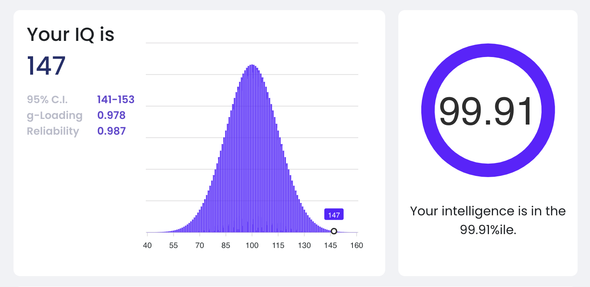

The score is a composite from [here](https://cognitivemetrics.co/), composing the individual scores below which themselves are derived from the tests even further below (SAT, AGCT, GRE, CAIT) weighted by their *g*-loading and reliability. IQ tests are inherently imprecise with SEs of around 5-10 points, probably more in the tails.  
An IQ of 135 has a frequency of ~ 1/100, 140 ~ 1/260, 145 ~ 1/740, 150 ~ 1/2300.   
  
Left to right the abbreviations stand for: Verbal Comprehension Index, Fluid Reasoning Index, Quantitative Intelligence Index, Visual Spatial Index, Working Memory Index, Processing Speed Index.  
  
You may wonder why the composite is higher than the average of the scores. Averaging scores would only make sense if they had a correlation of 1 since they'd essentially be different observations of the same thing. But they are not perfectly correlated, meaning they test slightly different things, meaning the underlying *general* ability must be higher than the ability in the specific subtests.  
Imagine measuring general athleticism via performance in gymnastics and long-distance running. Since the general athletic ability gets diluted by other factors in the specific activities, it will be higher than is measured by those two individual performances.

# SAT, AGCT, GRE
[Link](https://cognitivemetrics.co/)  
The 1980 SAT, the Army General Classification Test, and the old GRE have a very high *g*-loading. They are considered the gold standard of free tests since they can be normed against an enormous population of test takers.  

*You may have gotten here by clicking a link on my CV*: Following the link above leads to a website of cognitive testing enthusiasts who have automated (made digital) some of the classic American standardized tests. They are a little more condensed than the originals – the subtests take an hour each – but can draw from a large bank of questions and have norms available from their histories of test takers. You can convince yourself of their legitimacy by looking inside the tests.  
The SAT in this form has since been replaced I think, but the questions were drawn from before the 1994 recentering; clearly the GRE test is drawn from before 2011 since the scores go up to 800.
  

# CAIT
[Link](https://cognitivemetrics.co/)  
Inspired by the Wechsler (WAIS), this tests more facets simultaneously, but has a lower *g*-loading. The genuinely new aspects tested here are working memory (digit span) and processing speed (symbol search). The relevant number is the FSIQ at the very bottom.

