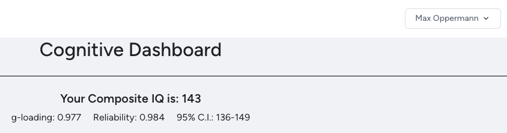
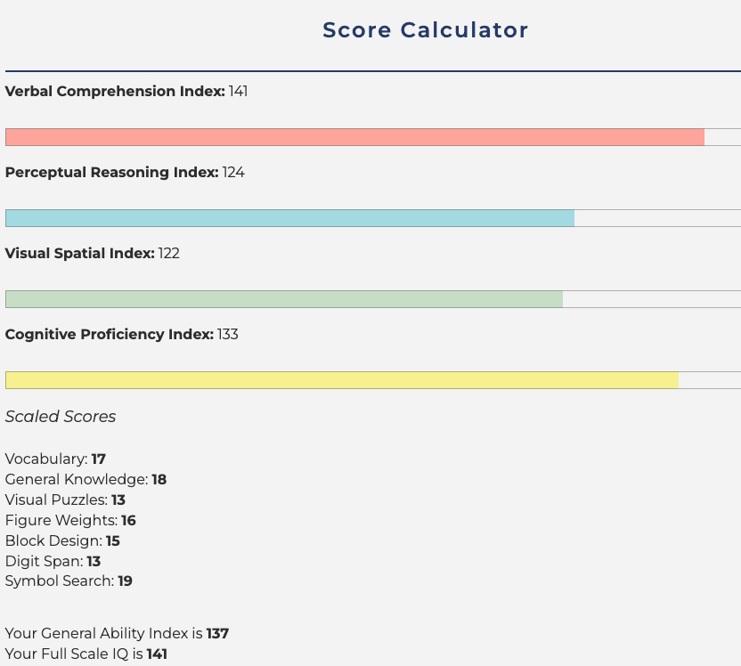
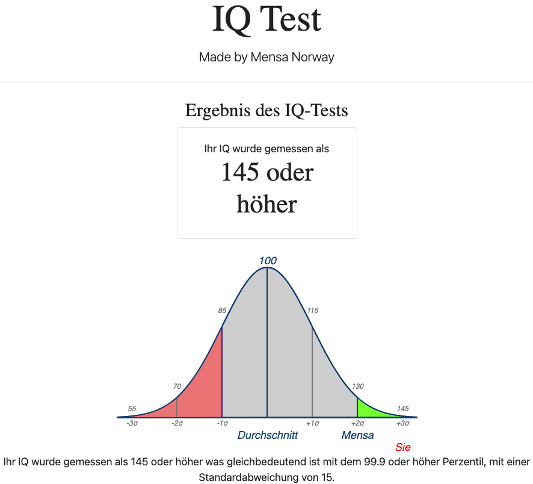
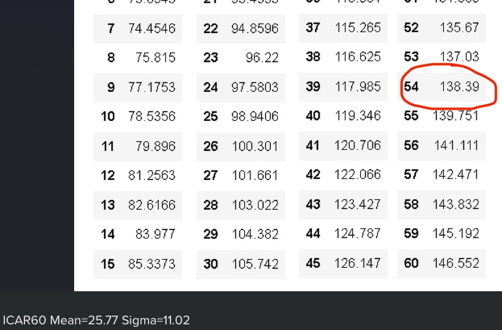

*If in doubt, try it out.* The longest of these tests is the CAIT taking a little longer than an hour, so if you have qualms about their meaningfulness just look at one of them yourself.  
IQ tests are inherently imprecise with SEs of around 5-10 points, probably more in the tails. An IQ of 135 has a frequency of ~ 1/100, 140 ~ 1/260, 145 ~ 1/740, 150 ~ 1/2300.

# SAT, AGCT, GRE
[Link](https://cognitivemetrics.co/)  
The 1980 SAT, the Army General Classification Test, and the old GRE have a very high *g*-loading. They are considered the gold standard of free tests. The specific scores are in the bottom image. The score in the top image is from a proprietary compositator not entirely transparent to me. According to the formula in [this article](https://pumpkinperson.com/2016/12/13/converting-pre-1995-sat-scores-to-iq-yet-again/#comments:~:text=Calculating%20full%2Dscale,of%20ceiling%20bumping.) the Full-Scale IQ (FSIQ) from those SAT scores would be $\left(\dfrac{1470-787}{198}\right)\times 15 + 100 \approx 152$ rather than 147. It probably doesn't matter to much in the grand scheme of things.  
  
  

# CAIT
[Link](https://cognitivemetrics.co/)  
This tests more facets simultaneously (SAT is only verbal, quantitative, and to some extent processing speed since it is timed), but has a lower *g*-loading. The genuinely new aspects tested here are working memory (digit span) and processing speed (symbol search). The relevant number is the FSIQ at the very bottom.

# Other tests
These are okay-ish tests. Their main value is that they test different kinds of items:  
[Mensa Norway](https://test.mensa.no/Home/Test/de-DE) is progressive matrices, testing abstract reasoning.  
  
The [ICAR60](https://planning.e-psychometrics.com/test/icar60) has many more visual-spatial items than the other tests (shape rotation).  
  

And a final one just because I score highest on it.  
There are no real screenshots for it, but Antjuan Finch provides an [intelligence quicktest](http://antjuanfinch.com/sgiq) (50 items, 12 minutes) and a ["Public Domain Intelligence Test"](http://antjuanfinch.com/pdit) (60 items, 30 minutes). The quicktest only includes quantitative and verbal items; I score 46/50 corresponding to an IQ of 149. The PDIT is one section of verbal items and one of progressive matrices; I score 29/30 on both corresponding to 148 verbal, 142 non-verbal, and an FSIQ of $(0.58(48+42))+100 = 152.2$ ... The test may be inflated at these extremes since this is outside the 95% CI from the more reliable tests at the top. But it could also be the case that the score is skewed *for me in particular* since it tests my three strongest aspects: Verbal, abstract reasoning, and processing speed. If it were an untimed test of visual-spatial ability, like the ICAR60, my score may have been lower even with the same norms.
