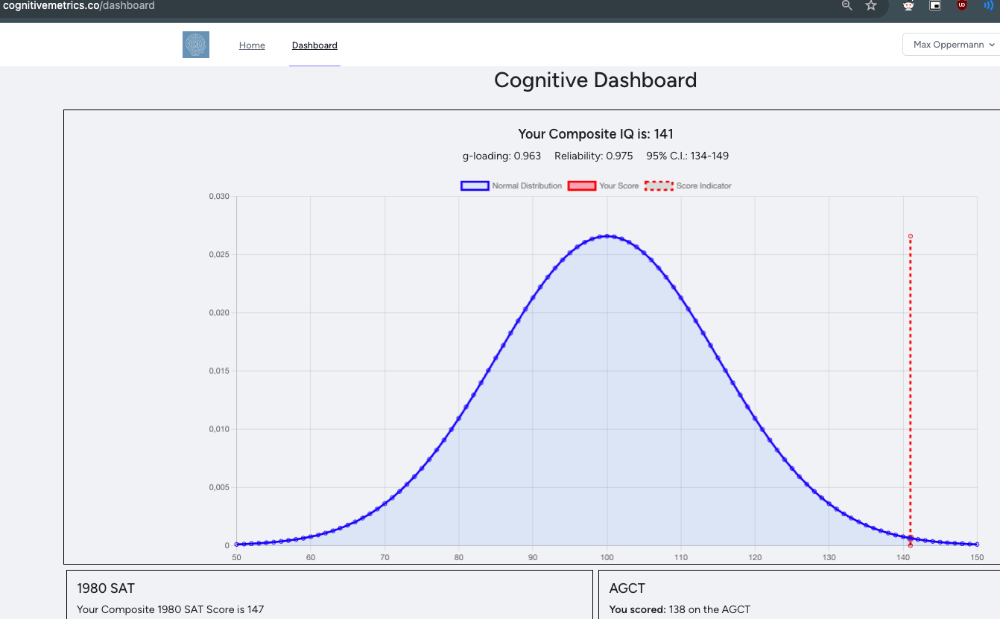

*If in doubt, try it out.* The longest of these tests is the CAIT taking a little longer than an hour, so if you have qualms about their meaningfulness just look at one of them yourself.

# SAT, AGCT
The 1980 SAT and the Army General Classification Test have a very high g-loading. They are considered the gold standard of free tests. The specific scores are at the bottom of the image and the direct SAT scores are 740 (SAT-M) and 730 (SAT-V). The latter is actually a higher percentile; the verbal part is universally experienced as harder. The score at the top is from a proprietary compositator not entirely transparent to me.  

# CAIT

# Other tests
Okay-ish tests but have different kinds of items:  
Mensa Norway is progressive matrices, testing abstract reasoning.  
  
The ICAR60 has many more visuo-spatial items than the other tests (shape rotation).  
  
