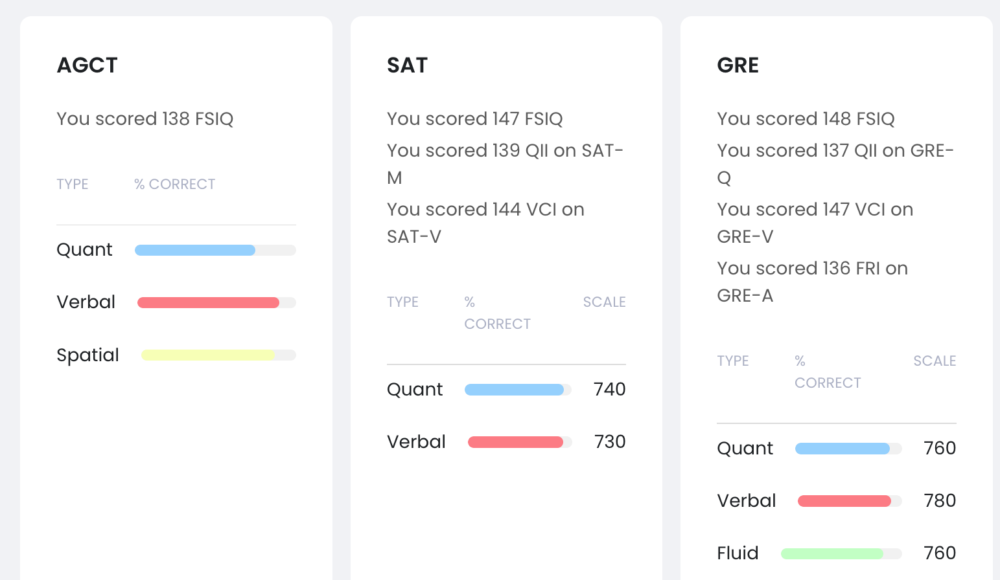

Meine allgemeinen quantitativen Fähigkeiten sind etwa im <ins>**99.87ten Perzentil**</ins>. In einem Raum mit 1000 Menschen, sollten ca. 12 bessere allgemeine quantitative Fähigkeiten besitzen.  

Allgemeine quantitative Fähigkeiten werden im SAT und GRE getestet. “Allgemeine” Fähigkeiten werden getestet, da keine komplizierte Mathematik gewusst werden muss; 
es geht darum, zügig die Struktur eines quantitativen Problems zu verstehen und dann Grundrechenarten und basale Geometrie anzuwenden, die jeder Testteilnehmer wissen sollte.  
Z. B.:  

>“On a 50-question multiple-choice test, 3 points were given for each question answered correctly and 1 point was deducted for each question answered incorrectly. 
>A student who answered all of the questions on the test received a total of 98 points.”  
>a) The number of questions on the test that the student answered incorrectly  
>b) 14  
>
>Choose exactly one:  
>1.) a > b  
>2.) b > a  
>3.) The two quantities are equal  
>4.) Relationship cannot be determined from the information given

Der SAT ist für High-School-Absolventen, die sich bei US Colleges bewerben; die GRE ist für College-Absolventen, die sich bei Graduate (PhD) oder Professional (MD, JD, MBA, …) Schools bewerben. 
Für ältere Versionen dieser Tests ist das “g-loading” bekannt, also die Korrelation mit dem g-Faktor, den IQ-Tests messen. 
Deshalb kann man unter https://cognitivemetrics.co/ eine Schätzung des eigenen IQs durch die Performance bei diesen Tests ermitteln.  
Andersrum kann ich dann aber aus diesem Score den Perzentilrang meiner quantitativen Fähigkeiten ableiten. Um aus einem Test mit bekanntem g-loading einen IQ abzuleiten, benutzt man folgende Formel:  
$\left( \dfrac{\text{eigener Score}-\overline{\text{Test}} }{\text{SD vom Test} } \right) \times \text{g-loading} \times \text{SD vom IQ} + \overline{\text{IQ}}$  
Der Ausdruck in der Klammer ist der $z$-Score des eigenen Testergebnis, der in Standardabweichungen auf der IQ-Skala übersetzt werden muss (per Definition ist die SD für IQ 15 und der Durchschnitt 100). 
Um nun an den $z$-Score meines Ergebnisses für die quantitativen Tests unten zu kommen, kann ich einfach das g-loading der Tests (SAT-M: 0.85. GRE-Q: 0.83) und das IQ-Ergebnis einsetzen und die Formel umstellen:  
SAT-M:  
$z \times 0.85 \times 15 + 100 = 139 \implies z = \dfrac{39}{0.85 \times 15} \implies z \approx 3.059$, was etwa dem 99.89ten Perzentil entspricht.  
GRE-Q:  
$z \times 0.83 \times 15 + 100 = 137 \implies z = \dfrac{37}{0.83 \times 15} \implies z \approx 2.972$, was etwa dem 99.85ten Perzentil entspricht.  

